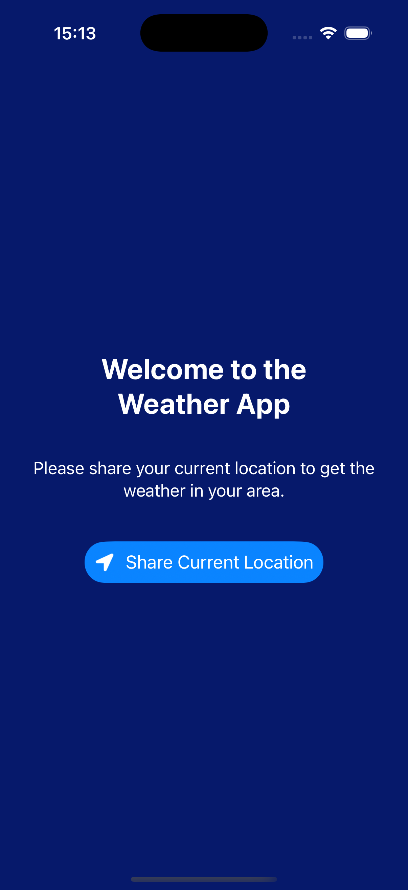
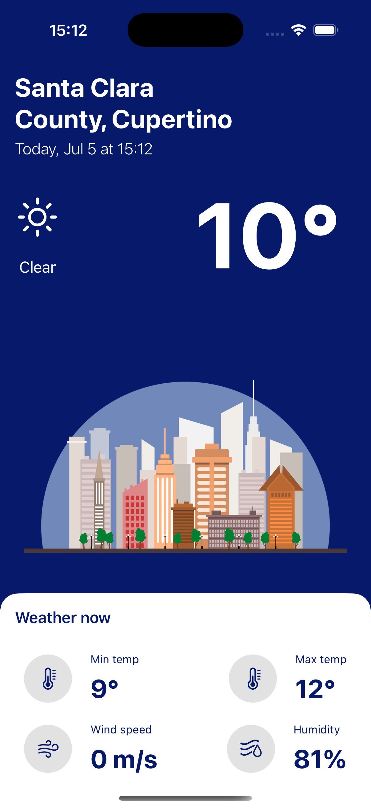

# 🌤 SwiftUI Weather App
A simple and modern weather app built using SwiftUI, CoreLocation, and OpenWeather API. This app fetches real-time weather data based on the user’s current location and displays details like temperature, weather conditions, wind speed, humidity, and more.
## Features
- Get weather for your current location

- Shows current temperature, min/max temps, humidity, and wind speed

- Weather icons and UI update based on current conditions

- Smooth location permission handling

- Async/Await networking with error handling

## Technologies Used
- SwiftUI – For building reactive user interfaces

- CoreLocation – To get the user’s coordinates

- OpenWeatherMap API – For fetching weather data

- Async/Await – For asynchronous data fetching

## Getting Started
- Clone the repository:
 ```git clone https://github.com/yourusername/SwiftUI-WeatherApp.git```

- Open the project in Xcode.

- Add your OpenWeather API key:

    - Open WeatherManager.swift

    - Replace the placeholder with your actual key: 

    ```private let apiKey = "YOUR_API_KEY"```
- Run the app on a simulator or real device.

## Screenshots

<div align="center">
  
  
</div>


## Requirements
- iOS 15.0 or later

- Xcode 14 or later

- Internet connection for fetching weather data

- OpenWeather API key (free signup at https://openweathermap.org/)
